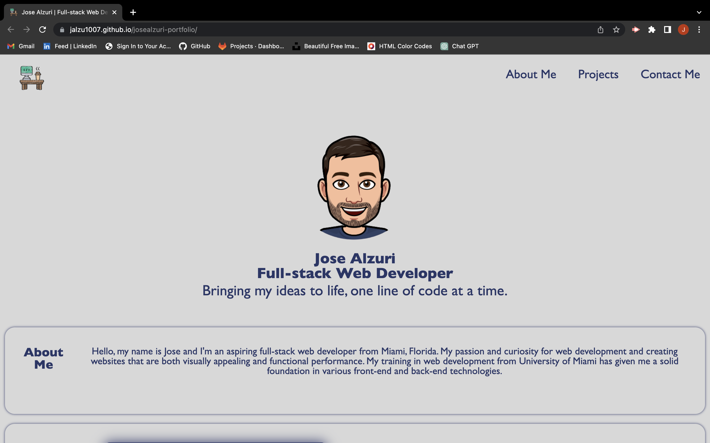
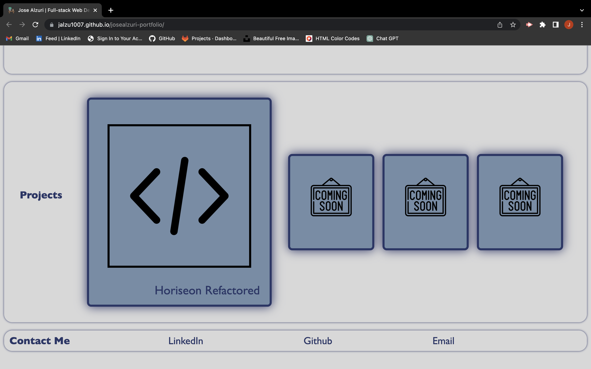
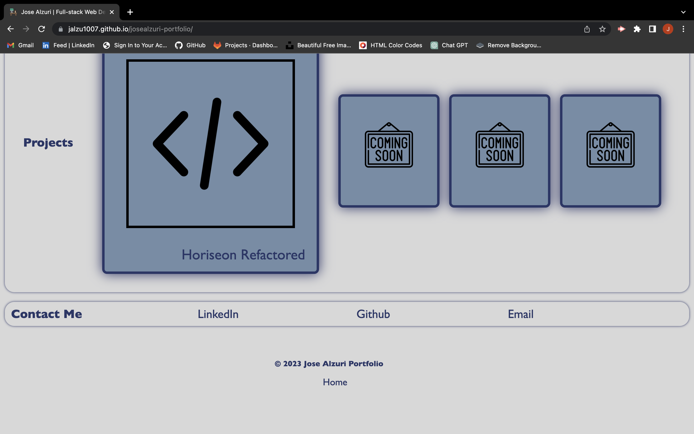

# josealzuri-portfolio

## Description

This project is my personal portfolio web page that showcases my work, skills, and talent to potential hiring managers. The web page presents my name, an avatar, and links to sections about me, my projects, and how to contact me. It displays titled images of the applications, which are deployed on the web, and their images are clickable and will take the user to the deployed application.

The motivation for building this project is to create an effective portfolio that highlights my best projects as well as the thought processes behind it. In addition, having several deployed projects is a minimum requirement to receive an initial interview at many companies. This web page will enable me to apply the core skills I have learned, such as flexbox, media queries, and CSS variables, while creating something that I can use during my job search.

## Installation

To install this project, follow these steps:

1. Clone the repository on your local machine using the following command:

git clone https://github.com/Jalzu1007/josealzuri-portfolio.git

2. Navigate to the repository's directory using the command:

 cd josealzuri-portfolio

3. Open the index.html file in your web browser to view the webpage.

## Usage

This web page is easy to use. When the user loads the portfolio, they will be presented with my name, an avatar, and links to sections about me, my projects, and how to contact me. By clicking on any of the navigation links, the user will be taken to the corresponding section.

The "Projects" section contains titled images of the applications that I have deployed on the web. When the user clicks on any of the application images, they will be taken to that deployed application.

Deployed website:

https://jalzu1007.github.io/josealzuri-portfolio/

Screenshot of the refactored code:

   

## Credits

I used the following third-party assets in this project:

- https://www.w3schools.com/html/html5_semantic_elements.asp
- https://www.freecodecamp.org/news/15-web-developer-portfolios-to-inspire-you-137fb1743cae/
- https://cssdeck.com/blog/what-is-a-css-reset/
- https://css-tricks.com/a-complete-guide-to-css-media-queries/
- https://flexboxfroggy.com/
- https://youtu.be/2KL-z9A56SQ
- https://meiert.com/en/blog/dry-css/
- https://youtu.be/fYq5PXgSsbE
- https://youtu.be/4ALLynsZ0u0
- https://youtu.be/GNmz5dYjdcQ
- https://www.flaticon.com/
- https://colorhunt.co/
- https://www.bitmoji.com/
- https://www.remove.bg/

## License

N/A
